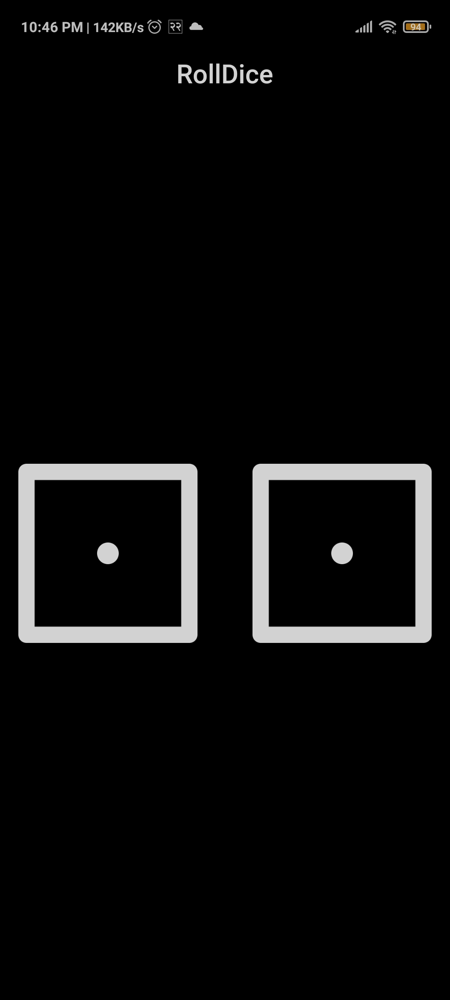
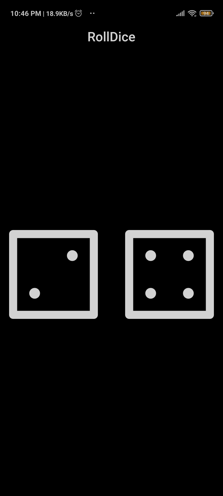
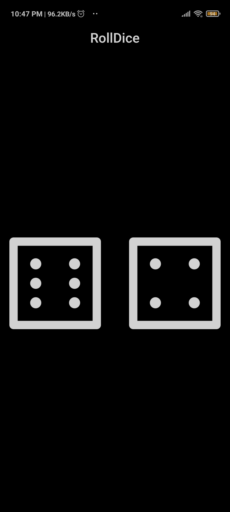

# RollDice
## Here are some of the demo screenshot for you
    
     
## Created & Maintained By

[@Shuvam Koirala](https://github.com/shuvam-koirala) ([Linkedin](https://www.linkedin.com/in/shuvam-koirala "LinkedIn Shuvam Koirala")) ([Youtube](https://www.youtube.com/channel/UCxei3a_ocUPux_foujUxYUg)) ([Medium](https://medium.com/@suvamkoirala08 "Medium Shuvam Koirala")) ([Facebook](https://www.facebook.com/shuvu00 "Facebook Shuvam Koirala")) ([Instagram](https://www.instagram.com/shuvu1112 "Instagram Shuvam Koirala")) ([Twitter](https://twitter.com/intent/follow?original_referer=https%3A%2F%2Fgithub.com%2Fshuvam-koirala&screen_name=koirala_shuvam "Twitter Shuvam Koirala"))

> If you found this project helpful or you learned something from the source code and want to thank me, star this repo ⭐.
